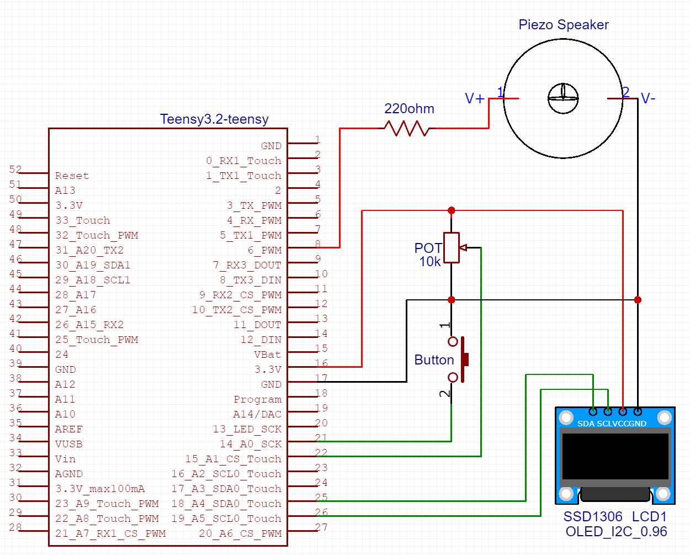
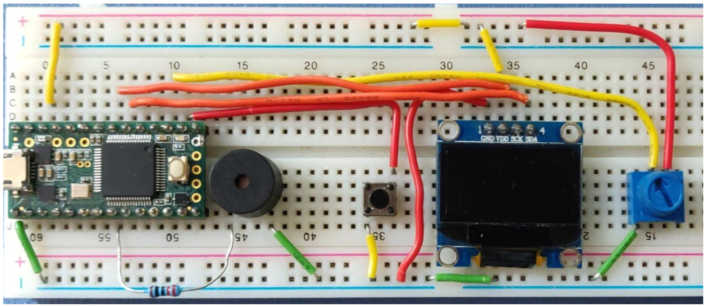
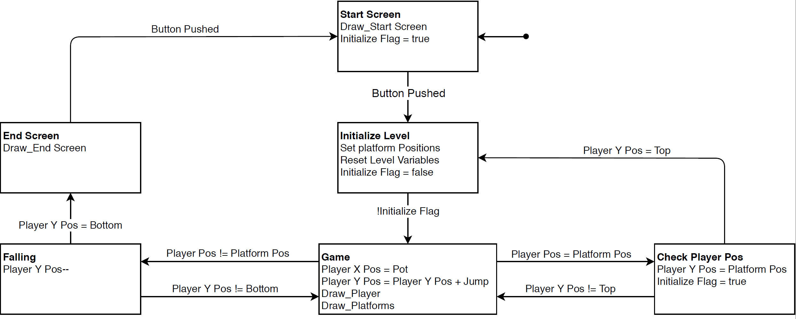
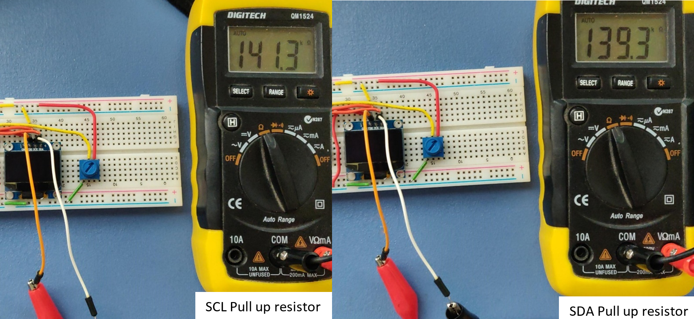
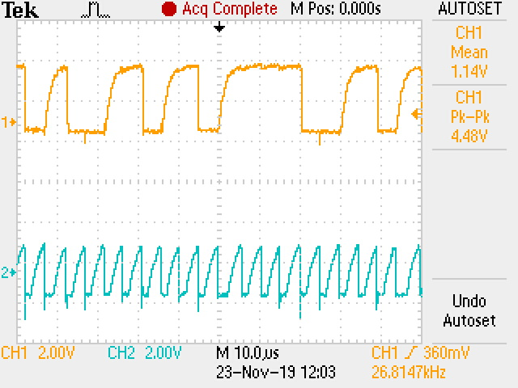
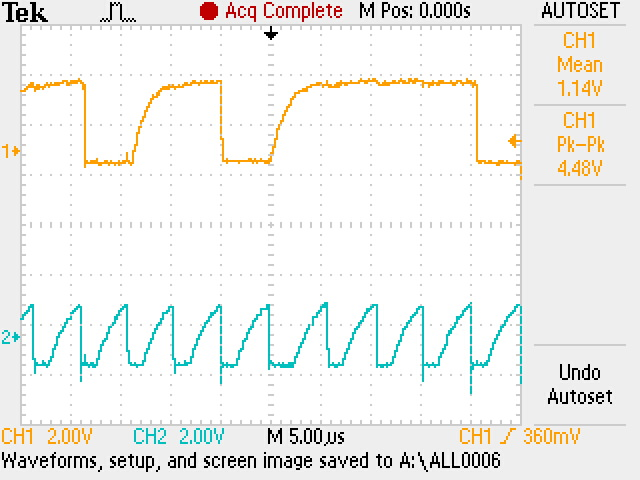

**Philip Moore**
**Embedded Systems Project 2**

**Overview:**

This project is about designing an embedded system based game, where the program flow is based on a finite state machine. This will be done using a Teensy microcontroller, a 128 x 64 Pixel OLED I2C SDD1306 screen for the game to be played on. A potentiometer and a button to control the game, and as an optional extra use of a piezo speaker for simple game sounds. The purpose of this project is to learn and understand how to create finite state machines and how to interpret them as C style code. As well as how to program a display and learn a bit more about I2C communication. It is assumed the reader at minimum has a basic understanding of electronic components and basic C style programming.

There are some given rules for the main project as listed below…

- Implement a start-screen, the actual game and an end screen.

- Display a player score (game-screen and end-screen).

- Implement debouncing of your button(s).

- Design and Implementation as a state-machine.

There are also some additional required tasks as listed below…

- Identify the resistance value of the pull-ups on the display module.

- Measure\capture an example waveform of the I2C clock and data line.

Show (e.g. with additional measurements) and discuss the impact of a change in the pull-up resistor values on the signal integrity

**Background:**

The 128x64 pixel screen being used, uses I2C communication. I2C works as a master, slave system. This means multiple devices can be connected to a single network; therefore, each device requires an address. It only uses 2 wires and being a synchronous communication method, 1 of those wires is used for the clock to keep all the data being transmitted and received in sync. This line is called SCL (Serial Clock). So only 1 wire is used for actual communication, this is called SDA  (Serial Data). Which means I2C is half-duplex, in that data can be sent in either direction on the line, but only in one direction at a time.

A typical I2C frame consists of a start condition where the master device pulls SDA to ground before SCL goes low. This will tell all the devices that a transmission is about to begin. The address data follows which contains a 7 bit address of the device meant to be receiving the data, along with a Read/Write bit to indicate whether the master is requesting or sending data. This is followed by an acknowledgement bit to indicate that the slave was or was not able to process the request, when it returns the transmission. Then the actual 8 bit data is sent, followed by a stop condition where SDA goes high after SCL goes high to indicate the transmission has ended.

The Screen is sent one of these frames for each pixel on the display. Hence if we were to send 00 00 00 01 to the display, the pixel on the top left, or position 0,0 would be turned on. Using the adafruit SSD1306 library, means we do not need to program the microcontroller to write every pixel to the display separately. Instead we store the images to be displayed as byte arrays. And can use the SSD1306 library functions to draw those images at any position on the screen.

A Piezo speaker is used to produce the sound effects for the game. This is done using the piezoelectric effect, where a material compresses or expands depending on the amount of electric charge added or removed to the material. This piezoelectric material can be stuck to a flexible plate, and as it compresses or expands it will force the plate to move in or out to compensate for the change. As the plate flexes and hits air molecules fast enough, it produces sounds which we can hear.

**Circuit Design:**

The circuit schematic was designed in EasyEDA and is shown below.



Along with the SDA and SCL connections for I2C communication, the display also requires a 3.3v Supply voltage and a connection to ground.

Potentiometers come in different shapes and sizes, the one used here is 10kΩ but any K series pot will work. The slider or glider terminal which is usually the middle pin on a 3pin potentiometer, is connected to an analog pin on the microcontroller, so the position of the potentiometer can be read. Then for the two outer pins, one is connected to ground, and the other to the 3.3v supply.

The button pin on the microcontroller pulls the pin to ground when pushed, so the pin has an internal pullup resistor activated. If not activated, then an external pullup resistor would be needed. To do this, you would place a large resistor around 10kΩ, between the side of the button that connects to the microcontroller and the positive 3.3v supply. This way when the button is not being pushed the teensy will read the input as High, and when the button is pushed it will read it as Low.

The piezo speaker needs a current limiting resistor. Since this type of speaker uses a voltage level to produce different tones, the current is used to adjust the volume. The larger the resistance the less current is sourced due to ohms law I = V/R. And with a smaller current there is a smaller sound produced. Without this current limiting resistor, the component would blow from trying to produce a sound too large for its form factor. This resistance started quite large at 1000 ohms to be safe, then decreased until the correct loudness was found which was at 220 ohms.

The fully built circuit as shown below.



**Program Design:**

The program flow was first designed as a Finite state machine as shown in fig 3. The initial program started with this but most of the game playing states were merged into a single state, and functions were made to control different aspects of the game.



All variables and constants were set as the smallest possible size integers to save space. Any variables dealing with the millis() function had to be 32 bit unsigned integers to match. Any variables used as flags were set as bool and used true or false to make the code easier to understand. The Adafruit_SSD1306 library was used for the display, as without would have made this project far too long. Where possible bitmaps were used to display objects rather than the inbuilt shape functions that come with the SSD1306 library. This way If an object in the game wanted to be changed or edited, it only required changing the byte array, and nothing else.

For this project there were several code iterations in order to get the fully functioning jumpr game.

The first program was copied from the adafruit template, sourced from the adafruit ssd1306 GitHub repository. The only change made to this template was changing the screen height from 32 pixels to 64. It then worked fine and all the test images were shown on the screen. This confirmed everything was working and connected properly.

Just by playing with the adafruit template it was easy to learn how the library worked. So, the programming of the game was started. The start screen was first implemented. This image was first designed using adobe photoshop, and then converted to a byte array through an online image to bitmap converter. This converted byte array was copied into the program and called on using the display bitmap function as shown below.

```c
display.drawBitmap(0, 0, start_screen_bitmap, 64, 128, WHITE); //Display start screen
```

The actual game was started next. First a switch case was created to handle the different states. All the states from the finite state machine design were incorporated, but it soon became clear, it would be easier to program the game states as functions. Since up until now this is how we have been learnt how to program. A button was then introduced in order to switch between the start screen and gameplay. An image was made for the platforms and converted to be used in the program as done previously. Although this image was only 16x3 pixels, so there could be multiple platforms within the game. Using the falling stars demo as inspiration, the same method was followed, using an array to store the platform positions instead. Then by simply using a for loop, multiple platforms could be drawn, within a compact amount of code. These platforms were initialized with random x and y positions, and then re-drawn with each loop of the program. This code was eventually turned into a function, called draw_platforms.

```c
if (initialize_platforms)
	{
	initialize_platforms =  false;
	for (i =  1; i < NUM_Platforms; i++) // Initialize platform positions once per level
	{
		platform_pos[i][X_platforms] = (random(0, 4)) * platform_pixel_width; //Random position out of 4 possible positions - 		Keeps platforms from overlapping or drawin outside screen
		platform_pos[i][Y_platforms] = ((128  - platform_pixel_height) - (i *  21)); //i*#, # needs to be divisaible by gravity
	}
}

for (i = current_platform; i < NUM_Platforms; i++) // Draw each platform
{
	display.drawBitmap(platform_pos[i][X_platforms], (platform_pos[i][Y_platforms]), platform_bitmap, platform_pixel_width, 			platform_pixel_height, WHITE);
}
```

Now that the level was created the character needed to be implemented, this was again created in photoshop then converted into a byte array, and variables for the character x and y position were created. Along with a variable called jumping which was used as a flag to indicate if the character is jumping up or not. Then a variable called jump height, which held the current height the character had jumped. A function was then created called jumpr, and program was written to make the character continually jump up and down. This was done by increasing or decreasing the jump_height each loop and re-drawing the character with y = character_y_pos - jump_height.

A potentiometer was added to interact with the character, and the character_x_pos was simply mapped to the analog read value of the potentiometer. This way a player could have control of the character.

With character movements done, it now needed to interact with the platforms. This was easily done by comparing the position of the character to the position of the platforms. Using a for loop and the platform position array, the characters current position was compared to all the platforms. An overlap was added so as long as the character was no more than 2 pixels on either side of the platform, the character could jump on that platform. And then from that, the character y pos was updated to equal the y position of the new platform. This was all put inside an if statement, so the character could only land on a platform after jumping. For example, it cannot jump, reach a platform and continue jumping. Instead it must jump, and as its falling if it lands on a platform then it can jump from that platform. And so as it lands on the platform, jump is reset to 0, and the character starts jumping again from the new platform height.

```c
if (not jumping) //Check only when jumpr on downward cycle of jump
{
	for (int i =  0; i < NUM_Platforms; i++) //Check for all platforms
	{
		if (jumpr_x_equals_platform_x(i)) //check if jumpr touching platfortm in x pos
		{
			if ((platform_pos[i][Y_platforms]) == ((jumpr_y_pos - jump_height) + jumpr_pixel_height)) //Check if jumpr touching platform in y pos
			{
				jumpr_y_pos = ((platform_pos[i][Y_platforms]) - jumpr_pixel_height); //Make Jumpr pos equal to platform height
				jump_height =  0; //Reset jump values as new platform reached
				jumping =  true;
				falling =  false;
				current_platform = i; //New platform reached, increase score
			}
		}
	}
}
```

Now the character was able to reach the top platform, and it was realised how easy the game was. There was only about 3 platforms that needed to be jumped on in order to reach the top. So, the entire display was rotated using display.setrotation(3), and the rest of the program changed to suit the new orientation. And a new start screen was designed.

With a taller screen size, it meant twice the number of platforms needed to be jumped on in order to reach the top, making it more difficult.

Falling was next introduced, so when the character position was at the same level as the current platform, if the x position of the character and platform did not match up, then the character would fall to the bottom of the screen, and loose the game.

```c
if ((jump_height ==  30) && (jumpr_y_pos <=  110))
{ //Check Jumpr is on platform at bottom of jump height & Cannot fall on initial platform
	if (not  jumpr_x_equals_platform_x(current_platform))
	{
		falling =  true;
		jumping =  false;
	}
}

if (falling)
{
	jumpr_y_pos = jumpr_y_pos + gravity;
	if (jumpr_y_pos >= (128)) //Jumpr falls to bottom - game over
	{
		game_over =  true;
	}
}
```

Throughout the program, the code seems counterintuitive, you would think the player starts at y pos 0, but because the display has the 0,0 pos set at the top right corner. The character must start at y pos = 128 – character height. Meaning when jumping the jump value is being subtracted, instead of added, and when falling the character y pos increases and so on.

An end screen was created next. If the player is falling and reaches the bottom of the screen it would end the game and switch to the end screen. From this the scores were then introduced. Since the platforms were in an array, each platform has a number. This number was used as the initial score and was stored it in a variable called current_polatform. Using the display.print function, it was easy to display the score on screen. This was done for the gameplay and for the end screen and was put into a function called draw_score. Where depending on the current game state, it would display the score as a different size and in a different region of the screen.

```c
void  draw_score()
{
if(game_over)
{
	display.setTextSize(2); //Draw score large
	display.setCursor(15, 75); //Draw just under Game Over text.
}
else
{
	display.setTextSize(1); //Draw score small
	display.setCursor(0, 0); //Draw out of the way in the top right corner
}

display.setTextColor(WHITE);
display.print(level); //Draw score
display.print(".");
display.print(current_platform);
}
```

Now that the game functionality was working, levels were introduced. A new function was created to reset all the game variables, so a new level could be played. Once the character reaches the top of the screen it calls this reset function, and a new level is started, and the score is updated to show the player reached a new level. But the gameplay was still too easy, if the player missed a platform they would fall and most likely land on another platform. So, to fix this, Once the player reached a new platform, the platforms below it disappeared. This was accomplished using a for loop to change the x and y positions of each platform under the current platform to 200,200. Which is far outside the playable screen area. But still gameplay was to simple, so on top of this change, it was made so platforms could only be jumped on once. This was done by including the current platform in the same for loop that was just made.

```c
for (i =  0; i <= current_platform; i++) //Make platforms dissapear
{
	platform_pos[i][X_platforms] =  200;
	platform_pos[i][Y_platforms] =  200;
}
```

Now the game was not only difficult, but much more enjoyable, as you became persistent with trying to beat it.

Up until, now the button was connected to an external interrupt, and used an Interrupt service routine to change a flag, then a delay for debouncing of the button. So, this was changed to be non-blocking using the millis() comparing debouncing method as shown below.

Lastly game sounds were needed to make it a better experience, this was done using the Arduino function tone(), where you can send a PWM signal to a piezo speaker and set a duration to have the tone play for a set time. Suitable sounds were added to the jumping of the character, the character falling and the end of the game.

With that the game was finished.

**Results:**

I2C results:

The Pullup resistor value for SCL was found to be 141.3kΩ, and SDA was 139.3kΩ. As shown below.


The waveform of SDA is CH1 shown in Orange. And SCL is CH2 shown in blue. Below is a zoomed out graph of both the wave forms, followed by a closer zoomed in graph of the same waveform.





Game results:

The basic functionality of the game is as follows.
It starts on an interactive start screen where the character can still be moved. Once the start button is pushed the game begins. The player is safe until they reach the first platform. Once a platform is reached, that platform disappears, and the player only has a small amount of time to reach the next platform otherwise they will fall to the bottom of the screen and game over. If the player gets to the top of the screen the game resets with a new level, and the player is safe until they jump onto the first platform, and the game repeats for as many levels as the player can reach.

A full video explanation of how the project works, how the code works and testing of the game, can be viewed here…
[https://1drv.ms/v/s!AhR3AIVP995qmxBWeK5ArsEjYp6a?e=7EhW0z](https://1drv.ms/v/s!AhR3AIVP995qmxBWeK5ArsEjYp6a?e=7EhW0z)

**Discussion / Conclusion:**

I2C Discussion:  

From the waveform captured for the SCL and SDA I2C pins. You can clearly see the data is in sync with the clock. However, the clock signal does not charge up to, and reach the full 3.3v before it goes low again. If this capacitance were much higher the system may fail as the voltage threshold to switch from Low to High may not be reached. To counteract this the pull up resistor could be decreased, so more current can flow, the signals would then charge up to 3.3v much quicker and would resemble more of a square wave.

From this waveform we can calculate the baud rate. Using the clock signal, in the zoomed in graph. There are 10 full clock pulses shown which takes 49us. This means a single pulse takes 4.9us. Using this the Bitrate = bits/second = 1bit / 4.9us = 1bit / 0.0000049s = 204,000bit/second. Since we are using single channel that means our baud rate is the same as the bit rate which equals 204,000.

Game Discussion:

This game was initially based on an extremely popular mobile game known as, “doodle jump”. Where a character jumps from platform to platform, and as the character reaches a new height the platforms move. I initially tried to implement this by using the falling stars template from the original adafruit example code. But this quickly became difficult and was decided static platforms would be much simpler.

Since the platforms were static, it became clear 3 platforms on a landscape display is far too easy to jump on to get to the top and win. Which also made the game very boring to play. The screen was then rotated to allow for 5 platforms which made it slightly harder. Originally this was done by rotating all the bitmaps and updating the code to suit. This took a few hours. It wasn’t until after getting it initially working in this orientation, I found a line of code that can set the orientation of the display, so adjusting all the values and rotating bitmaps was not necessary. I then went back to the previous working version and added in display.setRotation(3);. Which turns the display by 270o  for my application. The values were then adjusted to suit the new screen width and height.

The game was still far too easy to complete, so the added difficulty of vanishing platforms and new levels were added along the way. By this stage I had a good set of functions which controlled the program, so implementing new game behaviour was not too difficult. The programming of these game changes was created through consistent trial and error. Making the changes or adding extra functionality then testing, editing and repeating. A piezo speaker was used just to add the extra human sense of sound when playing the game and using the built in tone() library in Arduino, this was done in a short couple of hours.

The final version uses a potentiometer to control the character, and a button to start the game. And reset the game when you lose. The potentiometer was chosen so you could easily and precisely move a character to a set position on the screen. However, there was slight flickering at times where the character would move back and forth 1 pixel. To fix this I followed a tutorial from Arduino called RunningAverage. Which essentially makes it so only if the value of the potentiometer changes by a certain percentage then the character position would change.

There were more problems that came up along the way, such as my display having SCK, instead of SCL, and confusing a novice I2C user from the start. Then problems with the test code not working from function variables not being defined properly, since visual studio code works differently to the Arduino IDE. But the biggest problem is that these screens have the 0,0 position set at the top left hand coroner. This was not as much as a problem as it was more of a nuisance, as thinking about how the game works, I would logically be thinking the 0,0 pixel position is in the bottom left corner, as this is typically how x and y graphs are displayed. And this is how we have been taught all throughout school and university. This just made programming the game that much more difficult.

The final version works, but ideally there would be more platforms per level to jump onto. Since the screen is only 128x64 pixels, it is very limiting to what could be accomplished. Using just 5 platforms per level was too easy, and therefore the falling rate of the jumpr character had to be increased to increase the difficulty of each level even further. Ideally the character would be slightly slower and instead there would be more platforms per level, with added complexity such as moving platforms. Making the game play more interesting and enjoyable.

Also, the jumpr character jumps up and down with a constant speed. However, implementing some acceleration or gravity behaviour to the character could again make it more interesting and feel more realistic.

Overall the game works, just not as originally intended. It is still similar to doodle jump and the final version is just as addictive and enjoyable. Because of this I am very pleased with the outcome of this project.

**References:**

Arduino Playground - RunningAverage
(2019). Playground.arduino Retrieved 8 November 2019, from 
[https://playground.arduino.cc/Main/RunningAverage/](https://playground.arduino.cc/Main/RunningAverage/)

adafruit/Adafruit_SSD1306 Library
(2019). GitHub. Retrieved 8 November 2019, from
[https://github.com/adafruit/Adafruit_SSD1306](https://github.com/adafruit/Adafruit_SSD1306)

Image too bitmap Converter
Image2cpp » DIY Usthad. (2019). DIY Usthad. Retrieved 8 November 2019, from 
[https://diyusthad.com/image2cpp](https://diyusthad.com/image2cpp)

**Bibliography:**

Arduino Reference. - Tone
(2019). Arduino Retrieved 8 November 2019, from 
[https://www.arduino.cc/reference/en/language/functions/advanced-io/tone/](https://www.arduino.cc/reference/en/language/functions/advanced-io/tone/)

Articles, I., & Equipment, T. et al. (2019). How Piezoelectric Speakers Work - Technical Articles. 
Allaboutcircuits. Retrieved 23 November 2019, from 
[https://www.allaboutcircuits.com/technical-articles/how-piezoelectric-speakers-work/](https://www.allaboutcircuits.com/technical-articles/how-piezoelectric-speakers-work/)

Doodle Jump game
(2019). Play google Retrieved 22 November 2019, from 
[https://play.google.com/store/apps/details?id=com.lima.doodlejump&hl=en](https://play.google.com/store/apps/details?id=com.lima.doodlejump&hl=en)

Raquo M. (2019). Getting Started with OLED Displays.
Instructables. Retrieved 23 November 2019, from
[https://www.instructables.com/id/Getting-Started-With-OLED-Displays/](https://www.instructables.com/id/Getting-Started-With-OLED-Displays/)

(2016). Basics of the I2C Communication Protocol.
Circuit Basics. Retrieved 23 November 2019, from
[http://www.circuitbasics.com/basics-of-the-i2c-communication-protocol/](http://www.circuitbasics.com/basics-of-the-i2c-communication-protocol/)
